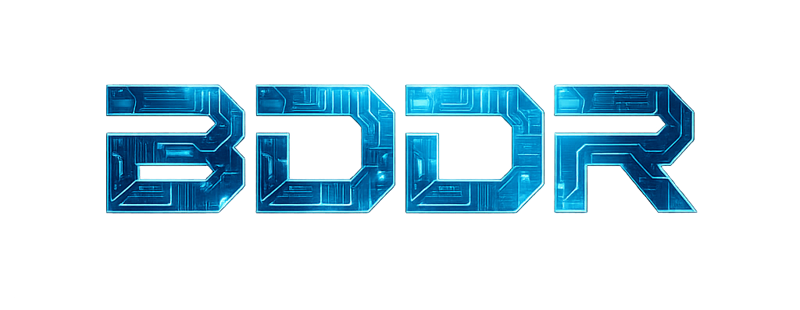

# README 

## One-pager website | Team Build Digital Design Right

## Description

This is the repository for our one-pager website. 
The one-pager website serves as a central platform to showcase what the main project is we are working on, with who and why. 

It is also the place where we give an update every sprint on our progression during this main project.

The website is currenly live on: https://project.cmi.hr.nl/2025_2026/idp_hw_t7/

## Key components of one-pager

- Context of main project
- Meet the team 
- Current siuation vs ideal situation
- Video demo of current product
- Timeline
- Showcasing of partners

## Languages

  

## Support

For any questions contact: 1053476@hr.nl

## Acknowledgements 

A special thanks to: 

- Rotterdam University of Applied sciences, for enabling a server where we can host our one-pager website.

## 

## Project status

This repository is still actively updated.

